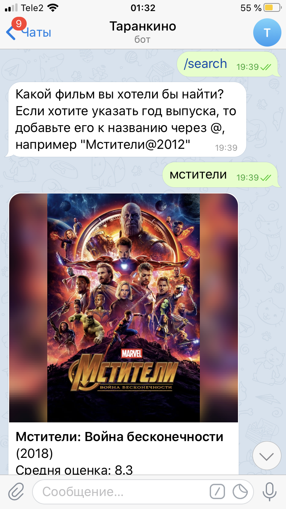
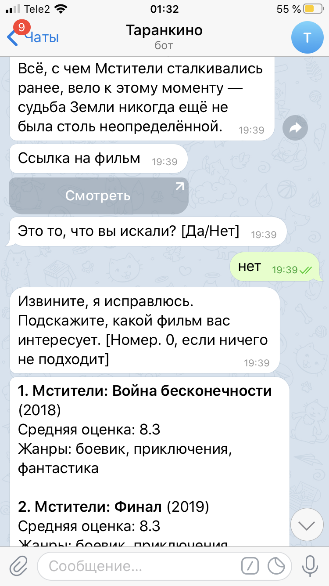
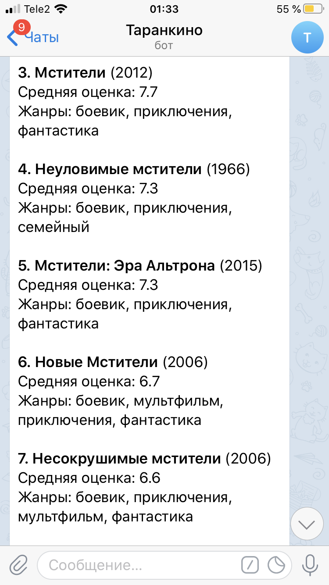

# Cinema Bot

@cinematgbot - бот, который помогает искать информацию и фильмах и ссылки для просмотра.

Умеет в поиск фильмов, поддерживает дополнительное указание года выпуска и подбор альтернативных фильмов в случае ошибки.

Исправляет в запросах орфографические ошибки при помощи Яндекс.Спеллер. Поиск фильмов и информации о них осуществляется
через базу tmdb, ссылка для просмотра выдается из распаршенной гугловой выдачи.
A            |  B | C
:-------------------------:|:-------------------------:|:-------------------------:
 |  | 

Бот **асинхронный**, реализован при помощи библиотек aiohttp и aiogram.
